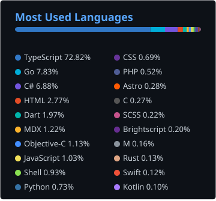

  <picture>
    <source media="(prefers-color-scheme: dark)" srcset="https://raw.githubusercontent.com/Narehood/Narehood/output/dist/pacman-contribution-graph-dark.svg">
    <source media="(prefers-color-scheme: light)" srcset="https://raw.githubusercontent.com/Narehood/Narehood/output/dist/pacman-contribution-graph.svg">
    
  </picture>

### GitHub Stats

  
  

### 👷 Check out what I'm currently working on
- [Narehood/xenadmin](https://github.com/Narehood/xenadmin) - A Modern XCP-ng Center (Alpha)
- [Narehood/Narehood-AI](https://github.com/Narehood/Narehood-AI) - Codex and AI skills
- [Narehood/rdgen](https://github.com/Narehood/rdgen) - custom client generator for rustdesk
- [Narehood/VM-Setup](https://github.com/Narehood/VM-Setup) - General Linux/XCP-ng VM setup scripts
- [Narehood/Stitch-Revitalized-For-Roku](https://github.com/Narehood/Stitch-Revitalized-For-Roku) - A Twitch app for Roku

### 🌱 My latest projects
- [Narehood/xenadmin](https://github.com/Narehood/xenadmin) - A Modern XCP-ng Center (Alpha)
- [Narehood/Narehood-AI](https://github.com/Narehood/Narehood-AI) - Codex and AI skills
- [Narehood/rdgen](https://github.com/Narehood/rdgen) - custom client generator for rustdesk
- [Narehood/VM-Setup](https://github.com/Narehood/VM-Setup) - General Linux/XCP-ng VM setup scripts
- [Narehood/Docker-Prep](https://github.com/Narehood/Docker-Prep) - Docker install and group setup helper

### ⭐ Recent Stars

- [authgear/authgear-server](https://github.com/authgear/authgear-server) - Open source Auth0/Clerk/Firebase alternative. Passkeys, SSO, MFA, passwordless, biometric login. Self-hosted or cloud. Enterprise-ready for SaaS &amp; mobile apps
- [ChrisTitusTech/titus-ai](https://github.com/ChrisTitusTech/titus-ai) - Codex and AI skills
- [pingdotgg/t3code](https://github.com/pingdotgg/t3code)
- [pingdotgg/uploadthing](https://github.com/pingdotgg/uploadthing) - File uploads for modern web devs
- [bryangerlach/rdgen](https://github.com/bryangerlach/rdgen) - custom client generator for rustdesk

### Socials

  <a href="https://github.com/Narehood" target="_blank" rel="noreferrer">
    <picture>
      <source media="(prefers-color-scheme: dark)" srcset="https://raw.githubusercontent.com/danielcranney/readme-generator/main/public/icons/socials/github-dark.svg" />
      <source media="(prefers-color-scheme: light)" srcset="https://raw.githubusercontent.com/danielcranney/readme-generator/main/public/icons/socials/github.svg" />
      
    </picture>
  </a>
  <a href="https://x.com/michaelnarehood" target="_blank" rel="noreferrer">
    <picture>
      <source media="(prefers-color-scheme: dark)" srcset="https://raw.githubusercontent.com/danielcranney/readme-generator/main/public/icons/socials/twitter-dark.svg" />
      <source media="(prefers-color-scheme: light)" srcset="https://raw.githubusercontent.com/danielcranney/readme-generator/main/public/icons/socials/twitter.svg" />
      
    </picture>
  </a>
  <a href="https://narehood.net" target="_blank" rel="noreferrer">
    <picture>
      <source media="(prefers-color-scheme: dark)" srcset="https://raw.githubusercontent.com/danielcranney/readme-generator/main/public/icons/socials/rss-dark.svg" />
      <source media="(prefers-color-scheme: light)" srcset="https://raw.githubusercontent.com/danielcranney/readme-generator/main/public/icons/socials/rss.svg" />
      
    </picture>
  </a>

